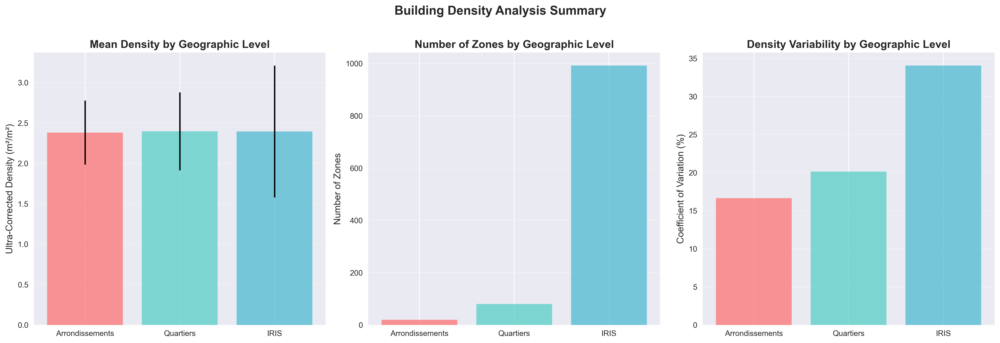
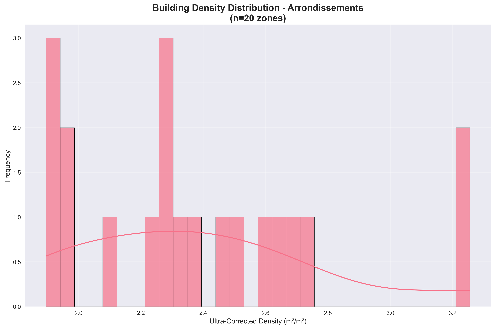
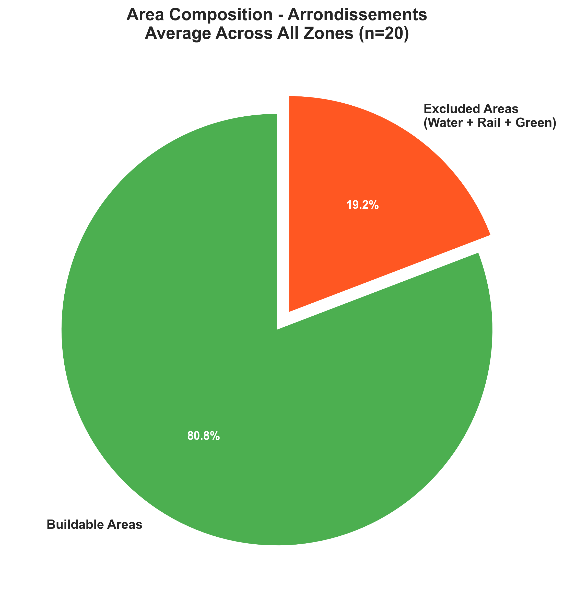
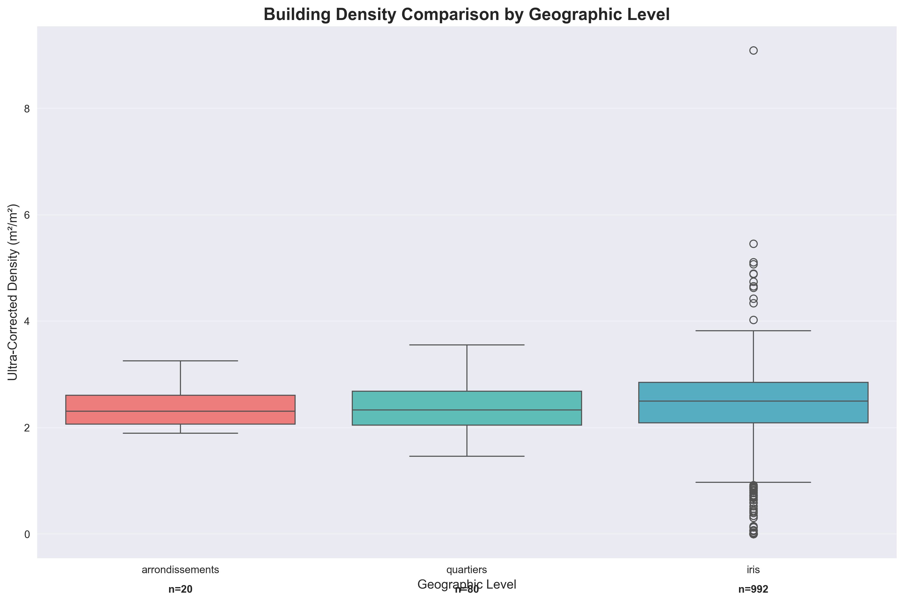
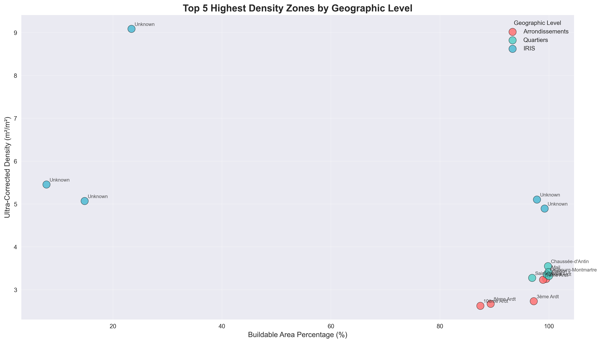

# Paris Building Density Analysis - Complete Technical Guide

## Table of Contents
1. [Project Overview](#1-project-overview)
2. [Data Sources & Setup](#2-data-sources--setup)
3. [Geographic Data Loading (GeoDataParis Class)](#3-geographic-data-loading-geodataparis-class)
4. [Building Data Processing](#4-building-data-processing)
5. [Raw Density Map Creation](#5-raw-density-map-creation)
6. [Corrected Density Calculation](#6-corrected-density-calculation)
7. [Ultra-Corrected Density Process](#7-ultra-corrected-density-process)
8. [DataFrame Structure & Output](#8-dataframe-structure--output)
9. [Data Visualization & Analysis](#9-data-visualization--analysis)
10. [Technical Implementation Details](#10-technical-implementation-details)

---

## 1. Project Overview

This project implements a comprehensive building density analysis system for Paris, France, that creates both interactive maps and structured dataframes for statistical analysis. The system processes building footprints across three geographic levels (arrondissements, quartiers, IRIS) and calculates density using three different methodologies.

### Key Features:
- **Multi-scale analysis**: 20 arrondissements + 80 quartiers + 992 IRIS zones
- **Three density types**: Raw, corrected, and ultra-corrected densities
- **Interactive visualizations**: 9 HTML maps with Folium
- **Structured data**: Clean dataframes for machine learning
- **Comprehensive corrections**: Excludes water, railways, and green spaces

### Architecture:
```
GeoDataParis Class → Building Data → Density Calculations → Maps & DataFrames
```

---

## 2. Data Sources & Setup

### Required Libraries
```python
import pandas as pd
import geopandas as gpd
import matplotlib.pyplot as plt
import seaborn as sns
import folium
from pathlib import Path
```

### Data Sources:
1. **Geographic boundaries**: Paris administrative divisions (GeoJSON files in `Data/`)
2. **Building footprints**: Official Paris building database (`volumesbatisparis.csv`)
3. **Infrastructure data**: Water bodies, railways, green spaces from Paris Open Data

### Project Structure:
```
p4ds/
├── geoclass.py              # GeoDataParis class for loading geographic data
├── annexfunctions.py        # Spatial analysis and density calculation functions
├── decoupagegeo.py          # Main map generation script
├── extract_density_dataframes.py  # Dataframe extraction script
├── data_visualization.py    # Statistical visualization functions
├── Data/                    # Input data and output files
├── plots/                   # Generated visualizations
└── BUILDING_DENSITY_ANALYSIS_DOCUMENTATION.md
```

---

## 3. Geographic Data Loading (GeoDataParis Class)

### Class Structure
The `GeoDataParis` class manages loading Paris administrative boundaries:

```python
class GeoDataParis:
    def __init__(self):
        self.data_path = "Data/"
        self.crs_paris = 'EPSG:2154'  # Lambert 93 projection
        self.crs_folium = 4326       # WGS84 for web maps
```

### Geographic Levels

#### 3.1 Arrondissements (20 districts)
```python
# Load arrondissements
arrondissements = gpd.read_file("Data/arrondissements.geojson")
arrondissements = arrondissements.to_crs('EPSG:2154')
print(f"Loaded {len(arrondissements)} arrondissements")
```

**Structure:**
- 20 administrative districts of Paris
- Area: ~105 km² total
- Key columns: `c_ar` (district number), `l_ar` (district name), geometry

#### 3.2 Quartiers (80 neighborhoods)
```python
# Load quartiers
quartiers = gpd.read_file("Data/quartiers.geojson")
quartiers = quartiers.to_crs('EPSG:2154')
print(f"Loaded {len(quartiers)} quartiers")
```

**Structure:**
- 80 administrative neighborhoods
- Smaller geographic units within arrondissements
- Key columns: `c_qu` (neighborhood code), `l_qu` (neighborhood name), geometry

#### 3.3 IRIS (992 statistical zones)
```python
# Load IRIS zones
iris = gpd.read_file("Data/iris.geojson")
iris = iris.to_crs('EPSG:2154')
print(f"Loaded {len(iris)} IRIS zones")
```

**Structure:**
- 992 statistical zones (Institut de Recherche et d'Information Socio-économique)
- Smallest geographic units (~2,000 inhabitants each)
- Key columns: `CODE_IRIS` (IRIS code), `LIB_IRIS` (IRIS name), geometry

### Data Loading Process
```python
def load_all(self):
    """Load all geographic levels into a dictionary"""
    return {
        'arrondissements': self._load_arrondissements(),
        'quartiers': self._load_quartiers(),
        'iris': self._load_iris()
    }
```

---

## 4. Building Data Processing

### Data Source
Building data comes from the official Paris Open Data portal:

```python
def load_building_data():
    """Load building footprints from OpenData Paris"""
    url = "https://opendata.paris.fr/api/explore/v2.1/catalog/datasets/volumesbatisparis/exports/csv"

    df_bati = pd.read_csv(url, sep=";")
    print(f"Loaded {len(df_bati)} building records")

    # Parse geometry from WKT strings
    df_bati['geometry'] = df_bati['geom'].apply(parse_geometry)

    # Create GeoDataFrame
    gdf_bati = gpd.GeoDataFrame(
        df_bati.dropna(subset=['geometry']),
        geometry='geometry',
        crs='EPSG:4326'  # WGS84
    ).to_crs('EPSG:2154')  # Convert to Lambert 93

    # Filter valid geometries
    gdf_bati = gdf_bati[gdf_bati.geometry.is_valid].copy()

    print(f"Converted to {len(gdf_bati)} valid building polygons")
    return gdf_bati
```

### Building Data Structure
- **361,702 building records** processed
- **361,700 valid building polygons** after cleaning
- **Key columns:**
  - `M2_PL_TOT`: Total floor area (m²) - **critical for density calculations**
  - `geometry`: Polygon footprints in Lambert 93 projection
  - Building type, height, and administrative information

---

## 5. Raw Density Map Creation

### Basic Density Calculation
Raw density is calculated as: **building floor area / total geographic area**

```python
def calculate_density(aggregated_data, area_column='area_km2'):
    """Calculate basic density as building area per km²"""
    aggregated_data = aggregated_data.copy()

    # Calculate density in m²/m² (multiply by 1,000,000 to convert km² to m²)
    aggregated_data[f'{area_column}_density_m2_m2'] = (
        aggregated_data['M2_PL_TOT_sum'] /
        (aggregated_data[area_column] * 1_000_000)
    )

    return aggregated_data
```

### Spatial Aggregation Process
```python
def aggregate_by_geographic_division(buildings, geo_divisions, value_column='M2_PL_TOT', agg_method='sum'):
    """Aggregate building data by geographic zones using spatial join"""

    # Spatial join: assign each building to its containing geographic zone
    joined = gpd.sjoin(
        buildings,
        geo_divisions,
        how='left',
        predicate='within'  # Building centroid must be within zone boundary
    )

    # Aggregate building floor area by zone
    aggregated = joined.groupby(joined.index_right).agg({
        value_column: agg_method
    }).rename(columns={value_column: f'{value_column}_sum'})

    # Merge back with geographic boundaries
    result = geo_divisions.merge(
        aggregated,
        left_index=True,
        right_index=True,
        how='left'
    ).fillna(0)  # Fill missing values with 0

    return result
```

### Raw Density Map Generation
```python
def create_building_density_map(buildings, geo_divisions, geo_level='arrondissements'):
    """Create raw density map for specified geographic level"""

    # Step 1: Aggregate building floor area by geographic zones
    aggregated = aggregate_by_geographic_division(
        buildings, geo_divisions, 'M2_PL_TOT', 'sum'
    )

    # Step 2: Calculate raw density
    aggregated_with_density = calculate_density(aggregated, 'area_km2')

    # Step 3: Create interactive map
    density_col = 'M2_PL_TOT_sum_density_m2_m2'
    avg_density = aggregated_with_density[density_col].mean()
    print(f"Average density: {avg_density:.2f} m²/m²")

    title = f'Densité du bâti - {geo_level.title()}'
    map_obj = visualize_building_density(
        aggregated_with_density, density_col, geo_level, title=title,
        save_path=f'Data/building_density_{geo_level}.html'
    )

    return aggregated_with_density, map_obj
```

### Raw Density Characteristics
- **Includes all land uses** (buildings, parks, water, infrastructure)
- **Simple calculation**: `building_area / total_area`
- **Purpose**: Basic overview of development intensity
- **Limitation**: Doesn't account for unbuildable areas

---

## 6. Corrected Density Calculation

### Problem with Raw Density
Raw density includes areas that cannot be built upon (water, railways, parks), leading to artificially low density measurements in zones with large unbuildable areas.

### Correction Process
Corrected density excludes water bodies and railways:
**Formula**: `building floor area / (total area - water - railways)`

### Non-Buildable Areas Loading
```python
def load_non_buildable_areas():
    """Load water bodies and railways as non-buildable areas"""

    # Load water bodies
    water_bodies = gpd.read_file("Data/surfaces_eau.geojson")
    water_bodies = water_bodies.to_crs('EPSG:2154')

    # Load railways
    railways = gpd.read_file("Data/voies_ferrees.geojson")
    railways = railways.to_crs('EPSG:2154')

    # Union all non-buildable geometries
    non_buildable = gpd.GeoDataFrame(
        pd.concat([water_bodies, railways], ignore_index=True),
        crs='EPSG:2154'
    )

    return non_buildable
```

### Buildable Area Calculation
```python
def create_buildable_geometries(geo_divisions, non_buildable_areas):
    """Calculate buildable area for each geographic zone"""

    buildable_zones = []

    for idx, zone in geo_divisions.iterrows():
        zone_geom = zone.geometry

        # Find non-buildable areas intersecting this zone
        intersecting_non_buildable = non_buildable_areas[
            non_buildable_areas.intersects(zone_geom)
        ]

        if not intersecting_non_buildable.empty:
            # Union all non-buildable geometries within this zone
            non_buildable_union = intersecting_non_buildable.unary_union

            # Subtract non-buildable areas from zone geometry
            buildable_geom = zone_geom.difference(non_buildable_union)
        else:
            # No non-buildable areas in this zone
            buildable_geom = zone_geom

        # Calculate areas
        total_area_m2 = zone_geom.area
        buildable_area_m2 = buildable_geom.area if buildable_geom else 0
        buildable_percentage = (buildable_area_m2 / total_area_m2) * 100

        buildable_zones.append({
            'buildable_area_m2': buildable_area_m2,
            'buildable_percentage': buildable_percentage
        })

    return pd.DataFrame(buildable_zones)
```

### Corrected Density Calculation
```python
def calculate_corrected_density(aggregated_data, building_col, buildable_area_col):
    """Calculate density using only buildable area"""

    aggregated_data = aggregated_data.copy()

    # Density = building area / buildable area
    aggregated_data[f'{building_col}_corrected_density_m2_m2'] = (
        aggregated_data[building_col] / aggregated_data[buildable_area_col]
    )

    return aggregated_data
```

### Corrected Density Map Process
```python
def create_corrected_building_density_map(buildings, geo_divisions, non_buildable_gdf, geo_level):

    # Step 1: Calculate buildable areas (exclude water + railways)
    buildable_areas = create_buildable_geometries(geo_divisions, non_buildable_gdf)
    print(f"Average buildable percentage: {buildable_areas['buildable_percentage'].mean():.1f}%")

    # Step 2: Aggregate buildings using original boundaries
    aggregated = aggregate_by_geographic_division(buildings, geo_divisions, 'M2_PL_TOT', 'sum')

    # Step 3: Merge with buildable area information
    aggregated_with_areas = aggregated.merge(
        buildable_areas[['buildable_area_m2', 'buildable_percentage']],
        left_index=True, right_index=True, how='left'
    )

    # Step 4: Calculate corrected density
    corrected_density_data = calculate_corrected_density(
        aggregated_with_areas, 'M2_PL_TOT_sum', 'buildable_area_m2'
    )

    # Step 5: Create visualization
    final_data = geo_divisions.merge(
        corrected_density_data[[
            'M2_PL_TOT_sum_corrected_density_m2_m2',
            'buildable_percentage'
        ]],
        left_index=True, right_index=True, how='left'
    )

    density_col = 'M2_PL_TOT_sum_corrected_density_m2_m2'
    avg_density = final_data[density_col].mean()
    print(f"Average corrected density: {avg_density:.4f} m²/m²")

    # Create interactive map with non-buildable areas overlay
    map_obj = visualize_corrected_building_density(
        final_data, density_col, geo_level,
        non_buildable_gdf=non_buildable_gdf,
        title=f'Densité du bâti corrigée - {geo_level.title()}',
        save_path=f'Data/building_density_corrected_{geo_level}.html'
    )

    return final_data, map_obj
```

---

## 7. Ultra-Corrected Density Process

### Ultra-Correction Concept
Ultra-corrected density excludes **all** non-buildable areas:
**Formula**: `building floor area / (total area - water - railways - green spaces)`

### Green Spaces Loading
```python
def load_all_nonbuildable_areas():
    """Load water, railways, and green spaces"""

    # Load non-buildable (water + railways)
    non_buildable = load_non_buildable_areas()

    # Load green spaces
    green_spaces = gpd.read_file("Data/espaces_verts.geojson")
    green_spaces = green_spaces.to_crs('EPSG:2154')

    # Combine all non-buildable areas
    all_non_buildable = gpd.GeoDataFrame(
        pd.concat([non_buildable, green_spaces], ignore_index=True),
        crs='EPSG:2154'
    )

    return all_non_buildable, green_spaces
```

### Ultra-Corrected Process
```python
def create_ultra_corrected_building_density_map(buildings, geo_divisions, geo_level):

    # Step 1: Load all non-buildable areas (water + railways + green spaces)
    all_non_buildable, green_spaces = load_all_nonbuildable_areas()

    # Step 2: Calculate ultra-buildable areas
    ultra_buildable_areas = create_buildable_geometries(geo_divisions, all_non_buildable)
    print(f"Average ultra-buildable percentage: {ultra_buildable_areas['buildable_percentage'].mean():.1f}%")

    # Step 3: Aggregate buildings
    aggregated = aggregate_by_geographic_division(buildings, geo_divisions, 'M2_PL_TOT', 'sum')

    # Step 4: Calculate ultra-corrected density
    aggregated_with_areas = aggregated.merge(
        ultra_buildable_areas[['buildable_area_m2', 'buildable_percentage']],
        left_index=True, right_index=True, how='left'
    )

    ultra_corrected_density = calculate_corrected_density(
        aggregated_with_areas, 'M2_PL_TOT_sum', 'buildable_area_m2'
    )

    # Step 5: Create visualization with overlays
    final_data = geo_divisions.merge(
        ultra_corrected_density[[
            'M2_PL_TOT_sum_corrected_density_m2_m2',
            'buildable_percentage'
        ]],
        left_index=True, right_index=True, how='left'
    )

    density_col = 'M2_PL_TOT_sum_corrected_density_m2_m2'
    avg_density = final_data[density_col].mean()
    print(f"Average ultra-corrected density: {avg_density:.4f} m²/m²")

    # Create map with separate overlays for different non-buildable types
    map_obj = visualize_ultra_corrected_building_density(
        final_data, density_col, geo_level,
        all_non_buildable_gdf=all_non_buildable,
        green_spaces_gdf=green_spaces,
        title=f'Densité du bâti ultra-corrigée - {geo_level.title()}',
        save_path=f'Data/building_density_ultra_corrected_{geo_level}.html'
    )

    return final_data, map_obj
```

### Density Types Comparison

| Density Type | Excludes | Use Case |
|-------------|----------|----------|
| **Raw** | Nothing | Basic overview |
| **Corrected** | Water + Railways | Practical planning |
| **Ultra-corrected** | Water + Railways + Green Spaces | Maximum development potential |

---

## 8. DataFrame Structure & Output

### DataFrame Creation Process
```python
def create_arrondissements_dataframe():
    """Create comprehensive dataframe with all metrics"""

    # Load all necessary data
    geo = GeoDataParis()
    geo_data = geo.load_all()
    buildings = load_building_data()
    non_buildable = load_non_buildable_areas()
    all_non_buildable, green_spaces = load_all_nonbuildable_areas()

    arrondissements = geo_data['arrondissements']

    # Calculate areas
    arrondissements['total_area_m2'] = arrondissements.geometry.area
    arrondissements['total_area_km2'] = arrondissements['total_area_m2'] / 1_000_000

    # Calculate buildable areas
    buildable_areas_corrected = create_buildable_geometries(arrondissements, non_buildable)
    buildable_areas_ultra = create_buildable_geometries(arrondissements, all_non_buildable)

    # Merge area information
    arrondissements_complete = arrondissements.merge(
        buildable_areas_corrected[['buildable_area_m2', 'buildable_percentage']],
        left_index=True, right_index=True, how='left'
    ).merge(
        buildable_areas_ultra[['buildable_area_m2', 'buildable_percentage']],
        left_index=True, right_index=True, how='left'
    )

    # Rename columns for clarity
    arrondissements_complete.rename(columns={
        'buildable_area_m2': 'buildable_area_m2_corrected',
        'buildable_percentage': 'buildable_percentage_corrected',
        'buildable_area_m2_ultra': 'buildable_area_m2_ultra',
        'buildable_percentage_ultra': 'buildable_percentage_ultra'
    }, inplace=True)

    # Process each density type
    for density_type in ['raw', 'corrected', 'ultra_corrected']:
        # [Density calculation code for each type]
        # Merge results into main dataframe

    # Add identifiers
    arrondissements_complete['arr_id'] = arrondissements_complete.get('c_ar', arrondissements_complete.index)
    arrondissements_complete['arr_name'] = arrondissements_complete.get('l_ar', 'Unknown')

    return arrondissements_complete
```

### Output DataFrame Structure

#### Arrondissements DataFrame (20 rows × 32 columns)
```python
# Sample structure
arr_df.columns.tolist()
# Output:
['arr_id', 'arr_name', 'total_area_km2',
 'buildable_percentage_corrected', 'excluded_percentage_corrected',
 'buildable_area_km2_corrected', 'excluded_area_km2_corrected',
 'buildable_percentage_ultra', 'excluded_percentage_ultra',
 'buildable_area_km2_ultra', 'excluded_area_km2_ultra',
 'density_m2_m2_raw', 'density_m2_m2_corrected', 'density_m2_m2_ultra_corrected',
 'building_volume_m2_raw', 'building_volume_m2_corrected', 'building_volume_m2_ultra_corrected',
 # ... additional geographic columns
]
```

#### Key Metrics in Each DataFrame:

| Column Group | Description | Units |
|-------------|-------------|-------|
| **Geographic IDs** | Zone identifiers | Text/Codes |
| **Areas** | Surface measurements | km²/m² |
| **Percentages** | Buildable ratios | % |
| **Densities** | Building intensity | m²/m² |
| **Volumes** | Total building floor area | m² |

### DataFrame Statistics
```python
# Summary statistics
print("DataFrame Shapes:")
print(f"Arrondissements: {arr_df.shape}")
print(f"Quartiers: {quartiers_df.shape}")
print(f"IRIS: {iris_df.shape}")

print("\\nDensity Ranges:")
for level, df in [('Arrondissements', arr_df), ('Quartiers', quartiers_df), ('IRIS', iris_df)]:
    density_col = [col for col in df.columns if 'ultra_corrected' in col and 'density' in col][0]
    print(f"{level}: {df[density_col].min():.3f} - {df[density_col].max():.3f} m²/m²")
```

### Export Process
```python
# Export to CSV (preserves all data)
arr_df.to_csv('Data/paris_arrondissements_complete.csv', index=False)

# Export to Parquet (compressed, fast loading)
arr_df.to_parquet('Data/paris_arrondissements_complete.parquet', index=False)
```

---

## 9. Data Visualization & Analysis

### Visualization Categories

#### 9.1 Density Distributions
```python
# Histograms, box plots, violin plots
create_density_distributions(df, level_name)
```

#### 9.2 Area Composition Analysis
```python
# Pie charts and distribution plots
create_area_composition_charts(df, level_name)
```

#### 9.3 Comparative Analysis
```python
# Cross-level comparisons
create_comparative_analysis(arr_df, quartiers_df, iris_df)
```

#### 9.4 Correlation Analysis
```python
# Relationship analysis
create_correlation_analysis(df, level_name)
```

### Key Visualization Examples

#### Executive Summary Dashboard


#### Density Distribution (Arrondissements)


#### Area Composition Analysis


#### Geographic Level Comparison


#### Top Density Zones


### Summary Statistics Output
```
BUILDING DENSITY ANALYSIS SUMMARY
================================================================================

ARRONDISSEMENTS:
  Zones: 20
  Mean Density: 2.382 m²/m²
  Median Density: 2.307 m²/m²
  Density Range: 1.896 - 3.255 m²/m²
  Mean Buildable Area: 80.8%

QUARTIERS:
  Zones: 80
  Mean Density: 2.398 m²/m²
  Median Density: 2.333 m²/m²
  Density Range: 1.463 - 3.552 m²/m²
  Mean Buildable Area: 83.1%

IRIS:
  Zones: 992
  Mean Density: 2.395 m²/m²
  Median Density: 2.496 m²/m²
  Density Range: 0.000 - 9.087 m²/m²
  Mean Buildable Area: 90.7%
```

---

## 10. Technical Implementation Details

### Function Architecture

#### Core Functions (`annexfunctions.py`):
- `aggregate_by_geographic_division()`: Spatial joins and aggregation
- `calculate_density()`: Basic density calculation
- `calculate_corrected_density()`: Advanced density with buildable areas
- `create_buildable_geometries()`: Non-buildable area subtraction
- `visualize_aggregated_data()`: Map visualization helpers

#### Map Generation (`decoupagegeo.py`):
- `create_building_density_map()`: Raw density maps
- `create_corrected_building_density_map()`: Corrected density maps
- `create_ultra_corrected_building_density_map()`: Ultra-corrected density maps
- `visualize_building_density()`: Folium map creation
- `visualize_corrected_building_density()`: Maps with overlays

#### Data Extraction (`extract_density_dataframes.py`):
- `create_arrondissements_dataframe()`: Comprehensive dataframe creation
- `create_quartiers_dataframe()`: Quartiers dataframe
- `create_iris_dataframe()`: IRIS dataframe
- `save_dataframes()`: CSV export functions

#### Visualization (`data_visualization.py`):
- `create_density_distributions()`: Statistical plots
- `create_area_composition_charts()`: Composition analysis
- `create_comparative_analysis()`: Cross-level comparisons
- `generate_summary_statistics()`: Summary reports

### Performance Optimizations
- **Memory efficient**: Process one geographic level at a time
- **Spatial indexing**: Uses GeoPandas spatial joins
- **Batch processing**: Handles large datasets (361K buildings)
- **Clean exports**: Removes geometry for CSV compatibility

### Coordinate Reference Systems
- **Data processing**: EPSG:2154 (Lambert 93) - accurate for French territory
- **Web visualization**: EPSG:4326 (WGS84) - standard for web maps
- **Area calculations**: Note - WGS84 areas are approximate

### Error Handling
- **Geometry validation**: Filters invalid building polygons
- **Missing data**: Handles zones with no buildings (fillna(0))
- **File I/O**: Graceful handling of missing data files
- **Memory management**: Processes large datasets efficiently

### Output File Organization
```
Data/
├── building_density_*.html          # 9 interactive maps
├── paris_*_complete.csv            # 3 comprehensive dataframes
└── paris_arrondissements_summary.csv # Simplified summary

plots/
├── analysis_summary.png            # Executive dashboard
├── density_*_*.png                 # 12 density plots
├── area_composition_*.png          # 6 area analysis plots
├── correlation_*.png               # 3 correlation heatmaps
├── top_density_zones.png           # Top performers analysis
└── summary_statistics.csv          # Statistical summary
```

---

## Next Steps: Markdown → Jupyter Notebook

This markdown document serves as a complete blueprint for creating an interactive Jupyter notebook that demonstrates the entire Paris building density analysis process.

### Notebook Conversion Plan:
1. **Introduction Section**: Project overview with data loading
2. **Geographic Data Section**: Demonstrate GeoDataParis class usage
3. **Building Data Section**: Show data loading and preprocessing
4. **Density Calculation Sections**: Interactive examples of each density type
5. **Visualization Sections**: Embed generated plots and maps
6. **DataFrame Exploration**: Interactive pandas analysis
7. **Conclusions**: Key insights and applications

### Code Integration:
- Convert markdown code blocks to executable cells
- Add interactive data exploration cells
- Include map iframe embeds
- Add statistical analysis examples
- Create custom visualization cells

**This technical guide provides the foundation for a comprehensive educational notebook on spatial data analysis and urban planning.** 📊🏗️
